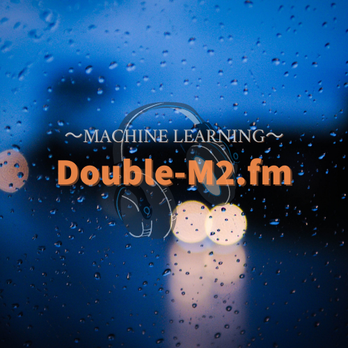

# [Double-M2.fm](https://anchor.fm/double-m2)

Double-M2.fmは偶然にも名前（first name）が同じ @navitacion と @asteriam_fp の2人の機械学習エンジニアがお届けするポッドキャストです．

- 毎週気になる話題 - テクノロジー・ビジネス・キャリアなど，2人が興味のあるトピックについてお話しします．

- 簡単に自己紹介
  - [@navitacion](https://twitter.com/navitacion):
  新卒で独立系ITベンチャーに入社し，Web広告運用やアクセス解析周りを担当するデジタルマーケティング業務に従事．より本格的なデータ分析をしたい，願わくばAIや機械学習といった技術に関われる仕事をしたいと一念発起．約2年半で退職した後，AIや機械学習を用いたメディア/コンサルティングを提供するスタートアップに転職．機械学習などのモデル実装やクライアントへの技術提案など上流から下流にかけて幅広く担当．2021年7月にFinTechのメガベンチャーに転職をし，現在に至る．

  - [@asteriam_fp](https://twitter.com/asteriam_fp):
  新卒でデジタルマーケティング基盤の導入を経験した後，AIベンチャーにて，製造業向けに時系列異常検知・外観検査・作業動作解析など複数プロジェクト，また自社プロダクトのフレームワーク開発に従事した後，前職では，toC向けアプリを開発している会社にて，レコメンドシステム・検索システムの導入，MLOpsの推進を担当後，1人目の機械学習エンジニアとして，2023年4月に3回目の転職をし，現在に至る．

- 記事
  - [Podcastによる配信のキッカケとその方法](https://masatakashiwagi.github.io/portfolio/post/podcast-broadcast-method/)
- 参考
  - [配信を行うための参考サイト](https://github.com/double-m2ml/podcast.fm/issues/2)

# Episode

- 第1回（2021/06/01）: [お互いの自己紹介と今までの経歴について](./episode/episode-001.md)
- 第2回（2021/06/07）: [今までのどのようにして転職してきたか](./episode/episode-002.md)
- 第3回（2021/06/21）: [Kaggleの取り組みや始めたきっかけは？](./episode/episode-003.md)
- 第4回（2021/06/28）: [リモートワークで使っている作業グッズ](./episode/episode-004.md)
- 第5回（2021/07/05）: [第1回 - 気になる技術記事の紹介](./episode/episode-005.md)
- 第6回（2021/07/19）: [社内で受けたオンボーディングトレーニングについて](./episode/episode-006.md)
- 第7回（2021/07/26）: [加入している保険や積立NISAなどの投資関連の話](./episode/episode-007.md)
- 第8回（2021/08/02）: [今まで観た映画やお互いの好きな映画について](./episode/episode-008.md)
- 第9回（2021/08/09）: [書籍紹介 - それはあくまで偶然です―運と迷信の統計学](./episode/episode-009.md)
- 第10回（2021/08/23）: [最近考えている今後のキャリアや方向性について](./episode/episode-010.md)
- 第11回（2021/08/30）: [第2回 - 気になる技術記事の紹介](./episode/episode-011.md)
- 第12回（2021/09/06）: [日常の中に潜んでいる行動経済学の紹介](./episode/episode-012.md)
- 第13回（2021/09/13）: [今まで経験してきたセミナーなどでの講師経験について](./episode/episode-013.md)
- 第14回（2021/09/20）: [第1回 - 技術書紹介](./episode/episode-014.md)
- 第15回（2021/09/27）: [サブスクリプションサービスって何か使ってる？](./episode/episode-015.md)
- 第16回（2021/10/04）: [機械学習システムを定量的に評価する手法であるML Test Scoreの紹介](./episode/episode-016.md)
- 第17回（2021/10/18）: [Gartner社が公開した「Hype Cycle for AI 2021」を語る](./episode/episode-017.md)
- 第18回（2021/10/25）: [論文紹介 - Personality Bias of Music Recommendation Algorithms](./episode/episode-018.md)
- 第19回（2021/11/01）: [書籍紹介 - OKR（オーケーアール）](./episode/episode-019.md)
- 第20回（2021/11/08）: [2021年におけるArtificial Intelligenceとは？](./episode/episode-020.md)
- 第21回（2021/11/15）: [今までで印象に残っているKaggleコンペ](./episode/episode-021.md)
- 第22回（2021/11/29）: [スプレッドシートでマン・ホイットニーのU検定を実装した話](./episode/episode-022.md)
- 第23回（2021/12/06）: [普段意識しているプライベート（業務外）でのアウトプット](./episode/episode-023.md)
- 第24回（2021/12/20）: [今年1年の振り返り](./episode/episode-024.md)
- 第25回（2022/01/10）: [書籍紹介 - ずる 嘘とごまかしの行動経済学](./episode/episode-025.md)
- 第26回（2022/01/17）: [MLOpsの事例紹介 - Looking into 2022: Predictions for a New Year in MLOps](./episode/episode-026.md)
- 第27回（2022/01/24）: [第3回 - 気になる技術記事の紹介](./episode/episode-027.md)
- 第28回（2022/01/31）: [発売予定のNintendo Switchのゲーム話で盛り上がる](./episode/episode-028.md)
- 第29回（2022/02/07）: [データの品質を高める考え方の「Data-Centric AI」を紹介](./episode/episode-029.md)
- 第30回（2022/02/14）: [人工生命やゲームを題材としたAIの技術検証](./episode/episode-030.md)
- 第31回（2022/04/11）: [初めての子育てで育休を2ヶ月取得してみて](./episode/episode-031.md)
- 第32回（2022/04/18）: [MLモニタリングで考えるべきメトリクスとドリフトの紹介](./episode/episode-032.md)
- 第33回（2022/04/25）: [個人開発を最近何かしていますか？](./episode/episode-033.md)
- 第34回（2022/05/16）: [AIの公平性の課題である「Model Fairness」について考える](./episode/episode-034.md)
- 第35回（2022/05/23）: [チーム開発など普段の開発どのように進めてますか？](./episode/episode-035.md)
- 第36回（2022/06/06）: [Podcast開始から1年経ったので振り返りしてみた](./episode/episode-036.md)
- 第37回（2022/06/20）: [ホットトピックな「NFT」ってどういうものなの？](./episode/episode-037.md)
- 第38回（2022/06/27）: [リーダーだけに任せない！「フォロワーシップ」という考え方](./episode/episode-038.md)
- 第39回（2022/07/04）: [Design Docsって知ってますか？](./episode/episode-039.md)
- 第40回（2022/07/18）: [記事紹介 - Trustworthy AI is Built on Trustworthy Data](./episode/episode-040.md)
- 第41回（2022/07/25）: [転職して1年経ってどうですか？](./episode/episode-041.md)
- 第42回（2022/08/01）: [MLエンジニアのキャリアについて](./episode/episode-042.md)
- 第43回（2022/08/15）: [チームビルディングアクティビティでより良いコミュニケーションを！](./episode/episode-043.md)
- 第44回（2022/08/29）: [Notionってどのように使ってますか？](./episode/episode-044.md)
- 第45回（2022/09/12）: [書籍紹介 - エネルギーをめぐる旅 文明の歴史と私たちの未来](./episode/episode-045.md)
- 第46回（2022/09/26）: [今話題のStable Diffusionについて](./episode/episode-046.md)
- 第47回（2022/10/03）: [8月末までのテック備忘録日記](./episode/episode-047.md)
- 第48回（2022/10/17）: [エンジニアリングの生産性を評価する - GSMフレームワークの紹介](./episode/episode-048.md)
- 第49回（2022/10/24）: [記事紹介 - A Systematic Approach to Reducing Technical Debt](./episode/episode-049.md)
- 第50回（2022/10/31）: [イベントの裏話について - 登壇と運営スタッフの経験から](./episode/episode-050.md)
- 第51回（2022/11/07）: [検索システムに機械学習を活用するってどんなことするの？](./episode/episode-051.md)
- 第52回（2022/12/05）: [たまには雑談でも - 最近の出来事など](./episode/episode-052.md)
- 第53回（2022/12/19）: [Spotifyのまとめを見ながら2022年の振り返り](./episode/episode-053.md)
- 第54回（2023/01/09）: [正月の過ごし方と2023年の抱負](./episode/episode-054.md)
- 第55回（2023/01/16）: [FinTech領域での機械学習適用とは？](./episode/episode-055.md)
- 第56回（2023/01/30）: [MLOps 2023年の予想 - Looking into 2023: Predictions for a New Year in MLOps](./episode/episode-056.md)
- 第57回（2023/02/13）: [おすすめのPythonライブラリは何ですか？](./episode/episode-057.md)
- 第58回（2023/02/27）: [記事紹介 - Machine Learning for Snapchat Ad Ranking](./episode/episode-058.md)
- 第59回（2023/03/06）: [記事紹介 - Data Science Project Quick-Start](./episode/episode-059.md)
- 第60回（2023/03/13）: [記事紹介 - What An MLOps Engineer Does](./episode/episode-060.md)
- 第61回（2023/03/27）: [記事紹介 - BIG DATA IS DEAD](./episode/episode-061.md)
- 第62回（2023/04/10）: [ChatGPTに関して思うこと・感じたこと](./episode/episode-062.md)
- 第63回（2023/04/17）: [30代以降のキャリアについて雑談](./episode/episode-063.md)
- 第64回（2023/04/24）: [記事紹介 - The Power of SuperGoals](./episode/episode-064.md)
- 第65回（2023/05/15）: [記事紹介 - MLOps Maturity Assessment（前編）](./episode/episode-065.md)
- 第66回（2023/05/29）: [記事紹介 - MLOps Maturity Assessment（後編）](./episode/episode-066.md)
- 第67回（2023/06/12）: [LLM/ChatGPT使ってますか？雑談会](./episode/episode-067.md)
- 第68回（2023/06/19）: [論文紹介 - Segment Anything](./episode/episode-068.md)
- 第69回（2023/06/26）: [Netflixのアートワーク選択ってどうやってるの？](./episode/episode-069.md)
- 第70回（2023/07/03）: [入社してから3か月経ったようで、ご状況どんな感じですか？](./episode/episode-070.md)
- 第71回（2023/07/10）: [2023年も半年過ぎたので、振り返りました！](./episode/episode-071.md)
- 第72回（2023/08/14）: [1か月振りのリハビリ会！](./episode/episode-072.md)
- 第73回（2023/09/11）: [二人の経験した機械学習関連ロールとチーム組織を語る](./episode/episode-073.md)
- 第74回（2023/09/25）: [健康について - 首肩こりや腰痛の悩みとその対策](./episode/episode-074.md)
- 第75回（2023/10/02）: [世の中のAI活用に関する取り組み紹介](./episode/episode-075.md)
- 第76回（2023/10/10）: [記事紹介 - ChatGPT can now see, hear, and speak](./episode/episode-076.md)
- 第77回（2023/10/23）: [シニアレベルの先のキャリアパスとして Staff Engineer を考えてみる](./episode/episode-077.md)
- 第78回（2023/10/30）: [データプロダクトとは何か](./episode/episode-078.md)
- 第79回（2023/11/06）: [AI/MLの情報収集普段どうしてますか？](./episode/episode-079.md)
- 第80回（2023/11/27）: [勉強会登壇のモチベーションってどこから来ます？](./episode/episode-080.md)
- 第81回（2023/12/11）: [クォーターライフ・クライシスってご存知ですか？](./episode/episode-081.md)
- 第82回（2024/01/08）: [2023年の振り返り&2024年の抱負](./episode/episode-082.md)
- 第83回（2024/01/15）: [データ分析失敗事例集から学ぶデータ分析プロジェクトで失敗しないためには](./episode/episode-083.md)
- 第84回（2024/01/29）: [「世界一流エンジニアの思考法」とはどういったものか？](./episode/episode-084.md)
- 第85回（2024/02/05）: [2024年の AI 予想 - The New AI Landscape: 10 Predictions in 2024](./episode/episode-085.md)
- 第86回（2024/02/12）: [最近の出来事について緩く話す雑談回](./episode/episode-086.md)
- 第87回（2024/02/19）: [推薦システムにおける Data-Centric な取り組みを調査した論文紹介](./episode/episode-087.md)
- 第88回（2024/03/04）: [書籍紹介 - 人生が整うマウンティング大全](./episode/episode-088.md)

# Others（質問・お便り・感想など）

質問・お便り・感想などはメールやTwitterのDMなどから頂ければと思います．

- メールアドレス: double.m2ml@gmail.com
- Twitter: @double_m2ml
  - ハッシュタグ: #double_m2fm
- googleフォーム: https://forms.gle/Cf5TUC1ZW1ErVvZdA
